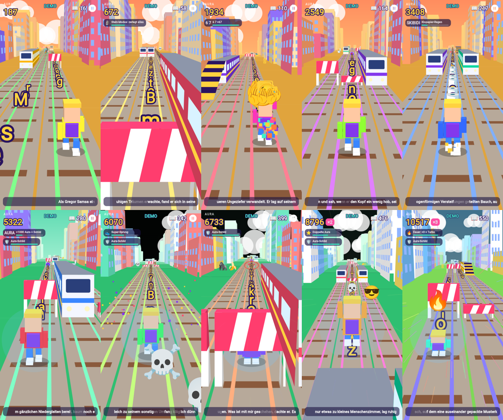

# Verwandlung Brainrot Runner (Flutter)



Ein echter Endless-Runner: Kafkas *Die Verwandlung*, Zeichen für Zeichen eingesammelt, mit Brainrot-Memes. Läuft auf Android, iOS und im Browser.

## Spielen

| Geste | Aktion |
|---|---|
| ⬅️ ➡️ wischen | Spur wechseln |
| ⬆️ wischen | Springen (über Schranken) |
| ⬇️ wischen | Rutschen (unter Balken); in der Luft: schnell runter |

Tastatur (Web/Emulator): Pfeiltasten oder WASD, Leertaste, P = Pause.

- **Züge**: frontal = Game Over. Gelbe **Rampen** führen auf die Zugdächer.
- **Stolpern**: Seitlich gegen einen Zug geprallt = Stolpern, und der Vater 🍎 jagt dich. Stolperst du nochmal, solange er hinter dir ist, erwischt er dich.
- **Zeichen**: Jedes Zeichen des Buchs liegt auf der Strecke. Unten läuft die Buchzeile mit: gesammelte Zeichen hell, verpasste blass.
- **Power-ups**: 🚀 Jetpack, 🧲 Magnet, ⭐ doppelte Aura, 👟 Super-Sprung (bis auf die Dächer)
- **Brainrot-Pickups**:

| Pickup | Effekt |
|---|---|
| 🪳 | Gregor wird zum Käfer und krabbelt unter Balken und über Schranken |
| 🗿 | Stein-Modus: zerlegt alles, riesige Moai |
| 💀 | Sprengt alle Hindernisse vor dir weg |
| 6 7 | 6-7-Tanz, +670 Aura |
| SIGMA | Riesig und unaufhaltbar |
| OHIO | Ohio-Welt, 360°-Rolle, **Steuerung vertauscht**, ×2 |
| SKIBIDI | Toiletten fallen vom Himmel, Klopapier-Bonus 🧻 |
| 🔥 | Turbo, unaufhaltbar, ×3 |
| AURA | +1000 Aura und ein Schild für einen Treffer |
| 🧠 | Big Brain: der Autopilot spielt für dich |
| RIZZ | Pinke Welt und Magnet |
| 🤑 | Geldregen 💸 |

- **👀 Demo** im Menü: Der Autopilot spielt, gut für Bildschirmaufnahmen.
- Highscore und Einstellungen werden auf dem Gerät gespeichert.

## Bauen

Voraussetzung: [Flutter](https://docs.flutter.dev/get-started/install) (getestet mit 3.47) und Android Studio bzw. das Android SDK.

```bash
flutter pub get
flutter run                      # auf angeschlossenem Handy/Emulator
flutter build apk --release      # APK: build/app/outputs/flutter-apk/app-release.apk
flutter build appbundle          # für den Play Store
flutter build ios                # später, auf einem Mac mit Xcode
```

Tests: `flutter test`. Der wichtigste Test lässt den Autopiloten mit mehreren Seeds je 10 Minuten spielen und stellt so sicher, dass jedes generierte Level schaffbar ist.

## Aufbau

- `lib/game/engine.dart`: komplette Spiellogik in reinem Dart (Physik, Kollisionen, Level-Generator, Effekte), ohne Flutter, testbar
- `lib/game/renderer.dart`: Pseudo-3D-Renderer auf einem `Canvas` (eigene Perspektiv-Projektion, kein 3D-Engine-Paket nötig)
- `lib/game/audio.dart`: Soundeffekte (`assets/sfx`, selbst synthetisiert)
- `lib/screens/`: Menü und Spiel (HUD, Wischsteuerung, Pause, Game Over)
- `assets/book.txt`: *Die Verwandlung* (Franz Kafka, 1915, gemeinfrei)

Für den Store fehlen noch ein eigenes App-Icon und eine Release-Signatur (`android/app/build.gradle.kts`).
