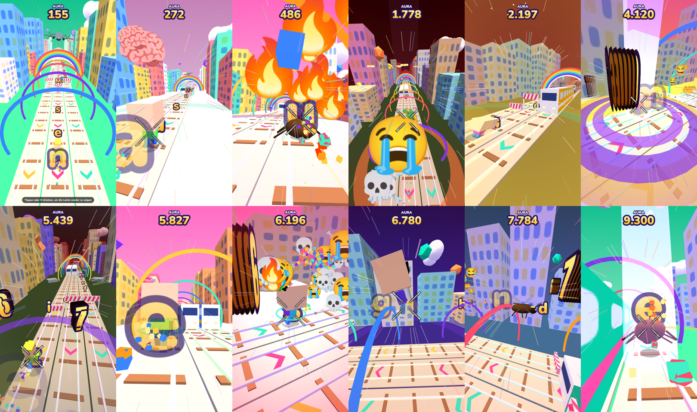

# Verwandlung Brainrot Runner

Kafkas *Die Verwandlung* als Endless-Runner im Subway-Surfers-Stil (three.js). Jedes Zeichen des Textes wird als Sammelobjekt im Takt der Lesung eingesammelt. Dazu kommen Brainrot-Elemente in 3D.

## Dateien

- `index.html`: Brainrot-Version
- `original.html`: Ausgangsversion ohne Brainrot

## Starten

`index.html` im Browser öffnen (Chrome oder Edge empfohlen, three.js und die Schrift werden online geladen).

## Brainrot-Features

- **3D-Meme-Sammelobjekte** (keine eingeblendeten Texte, damit Untertitel frei bleiben). Jedes löst einen Effekt aus:
  - 🪳 Gregor verwandelt sich in einen Käfer
  - 🗿 Riesige Moai-Köpfe wachsen aus dem Boden
  - 💀 Explosion aus 3D-Totenköpfen
  - 6 7: 6-7-Geste mit riesigen 3D-Ziffern
  - SIGMA: Gregor wird riesig
  - OHIO: Ohio-Welt mit 360°-Kamerarolle
  - SKIBIDI: Toiletten fallen vom Himmel
  - 🔥: Flammenspur und Turbo
  - AURA: Lichtstrahl in den Himmel, +1000 Aura
  - 🧠: Riesenkopf
  - RIZZ: Herzen und pinke Welt
  - 🤑: Geldregen und doppelte Punkte
- **Italian-Brainrot-Cameos** aus 3D-Grundformen: Tralalero Tralala, Bombardiro Crocodilo, Tung Tung Tung Sahur, Ballerina Cappuccina, Skibidi Toilet, 🗿
- MLG-Hitmarker, „Deal with it“-Brille, synthetischer Vine-Boom, Airhorn
- Der Button **Brainrot** schaltet alles ab

## Steuerung

- Tempo: 1×, 2×, 3×, Extrem 15×
- Format 9:16, Ton, Score, Leiste ausblenden (H)
- MP4-Export (15 s bis 2 h, Loop) über WebCodecs
